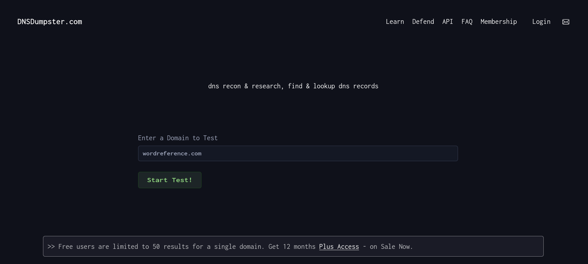

# DNSDumpster

[DNSDumpster](https://dnsdumpster.com) es una herramienta en línea utilizada para obtener información detallada sobre un dominio y su infraestructura de DNS. Proporciona un conjunto de funciones que permiten realizar investigaciones en DNS de manera rápida y sencilla. Tiene muchas similitudes con lo que hace *DNSRecon*, pero muestra la información de forma más visual y clara. El inconveniente es que para tener acceso completo a la herramienta es necesario tener una suscripción.

## Guía de uso

Para usarla simplemente entramos a su web y escribimos un dominio en el buscador.

[⟵ Anterior](../01_information_gathering.md#reconocimiento-dns)
