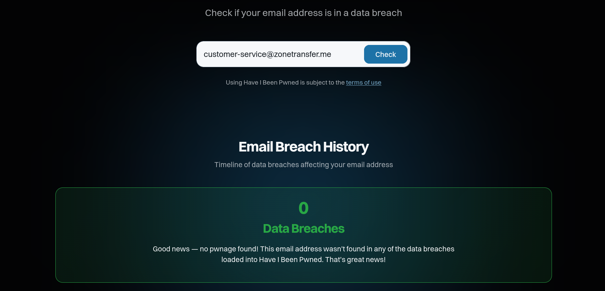

# Have i been pwned?

Es un sitio web de ciberseguridad creado por Troy Hunt que permite comprobar si una dirección de correo o contraseña ha aparecido en filtraciones de datos conocidas. En un pentest es interesante porque los atacantes también tienen acceso a esta información.

## Guía de uso

Para usarlo podemos acceder a su web y comprobar si alguno de los correos que hemos obtenido con [theHarvester](theharvester.md) se ha filtrado en algún momento

## Recursos

[Have i been pwned?](https://haveibeenpwned.com/)

[⟵ Anterior](../02_pasiva/.md#)
