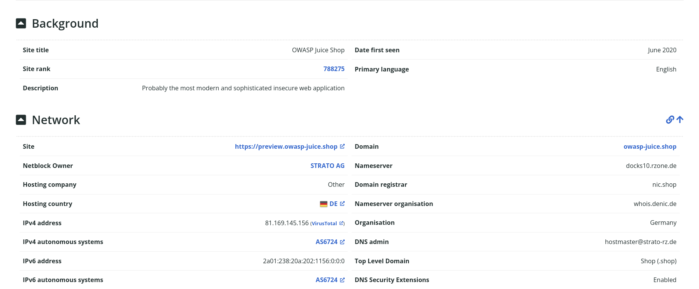
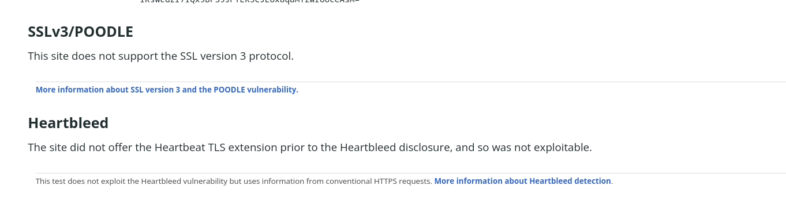

# Netcraft

Netcraft es una herramienta web que muestra toda la información disponible públicamente sobre un sitio web. Podemos ver información whois, sobre certificados SSL/TLS, tecnologías usadas en el sitio, nombres de servidores, etc.

## Guía de uso

Para usar Netcraft debemos acceder a este [enlace](https://sitereport.netcraft.com/) e introducir la URL del sitio del que queremos obtener informaicón.

Es interesante destacar que netcraft nos permite ver si el sitio es vulnerable a [POODLE]() y [Heartbleed](). En este caso podemos ver que el sitio no es vulnerable a ninguna.

## Riesgo de detección

El riesgo de detección es prácticamente nulo, ya que las consultas se realizan a un servidor externo y se consulta información disponible de forma pública.

[⟵ Anterior](../02_pasiva.md#reconocimiento-web)