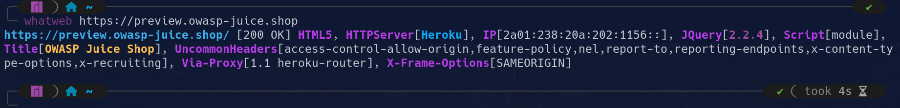
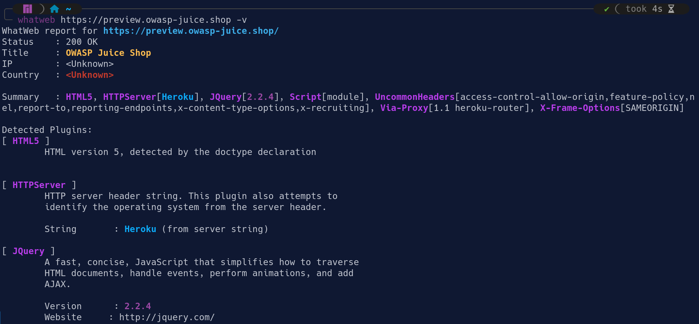

# WhatWeb

WhatWeb es un programa de código abierto para recopilar información sobre una aplicación web. Es un escáner de nueva generación que detecta las tecnologías utilizadas en el desarrollo de una página web. WhatWeb permite identificar tecnologías como:

- Sistemas de gestión de contenidos.
- Plataformas de blog.
- Paquetes de estadísticas/analítica.
- Librerías de JavaScript.
- Servidores web.
- Dispositivos integrados.
- Versiones de software.
- Direcciones email relacionadas.
- ID de cuentas de usuarios.
- Módulos de frameworks utilizados.
- Errores SQL.

## Guía de uso

Por defecto, whatweb realiza un escaneo con nivel de agresión 1. Esto implica un escaneo pasivo y aunque obtenga información menos detallada, puede ser relevante. En este modo, no obtenemos mucha información pero puede ser relevante. Por ejemplo, en este caso podemos ver la versión de JQuery usada en la web, además de su dirección IP y servidor HTTP.

Con el modo verbose (opción -v), obtenemos la misma información, pero más detallada y con una visualización más clara.

## Riesgo de detección

Esta herramienta funciona por defecto en modo sigiloso, es decir, hace una petición HTTP por objetivo. Esto hace que aunque pueda ser detectado, no levante sospechas ya que realiza conexiones normales. También dispone de un modo agresivo donde se realizan varias peticiones para obtener información más precisa, pero con mayor riesgo de detección.

En su modo pasivo, whatweb:

- Hace solo una petición HTTP estándar (GET).
- No manipula cabeceras ni envía pruebas adicionales.
- No realiza fuzzing ni cargas inusuales.
- No interactúa de manera detectable por un IDS/IPS.

## Recursos

- [¿Qué es whatweb?](https://keepcoding.io/blog/que-es-whatweb/)
- [Cómo usar WhatWeb para escanear cualquier sitio Web](https://www.youtube.com/watch?v=cO5UVYsTIjk)

[⟵ Anterior](../01_information_gathering.md#reconocimiento-web)