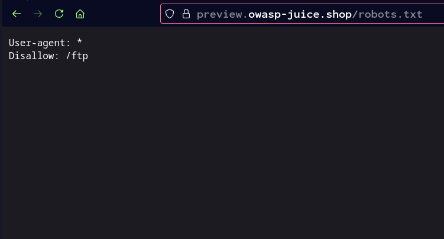

# Archivo robots.txt

El archivo robots.txt es un archivo de texto que se coloca en la raíz de un sitio web (por ejemplo: https://tusitio.com/robots.txt) y sirve para dar instrucciones a los motores de búsqueda sobre qué partes del sitio pueden o no pueden explorar. Se usa principalmente para:

- Optimizar el rendimiento del servidor bloqueando partes innecesarias.
- Evitar la indexación de cierto contenido.
- Especificar la ubicación de sitemap.xml

La información contenida en robots.txt puede ser útil durante un pentest si revela áreas sensibles como directorios de administración.

[⟵ Anterior](../02_pasiva.md#reconocimiento-web)