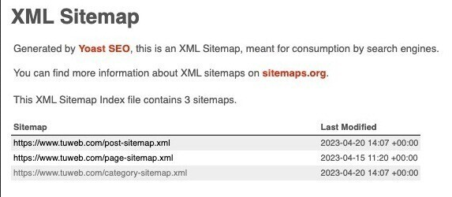

# sitemap

El archivo sitemap es un archivo XML que proporciona a los buscadores una forma organizada de indexar el sitio web. Este archivo describe su estructura y URLs. Puede encontrarse de varias formas, aunque las más comunes son:

- /sitemap.xml
- /sitemap/
- /sitemap_index.xml

Aunque su propósito es SEO, puede proporcionarnos una fuente valiosa de información al incluir URLs de páginas de administración y paneles internos entre otros. Además permite mapear la superficie de ataque, exponer versiones antiguas de la página y encontrar metadatos filtrados accidentalmente.

## Guía de uso

<!-- comandos, ejemplos y salida esperada -->

## Riesgo de detección

El riesgo de detección al consultar un sitemap.xml durante un pentest es muy bajo porque no es intrusivo y no altera datos. Normalmente no genera alertas de seguridad, pero sí logs al quedar registrada la petición HTTP.

[⟵ Anterior](../01_information_gathering.md#reconocimiento-web)