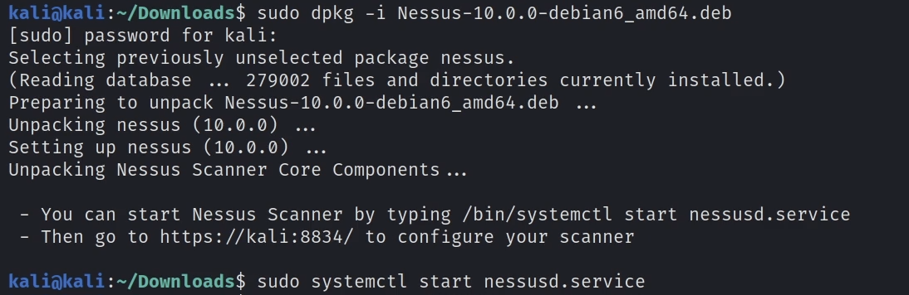
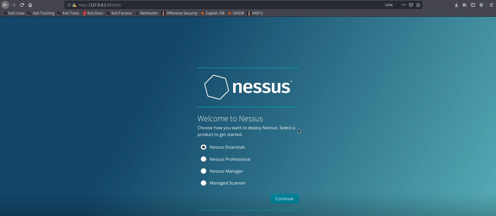
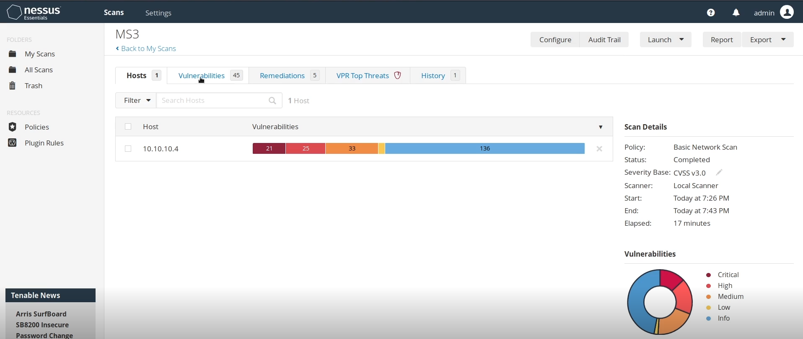

# 2. Herramientas de escaneo y análisis de vulnerabilidades

Existen diversas herramientas que permiten automatizar el escaneo de vulnerabilidades, como *Nessus*, *OpenVAS*, *Nikto* y *Nmap*, junto con utilidades adicionales como los módulos auxiliares de *Metasploit* o herramientas como *searchsploit*, que facilitan la identificación de posibles vectores de ataque

El escaneo y la detección de vulnerabilidades consisten en analizar un sistema objetivo con el fin de identificar posibles fallos de seguridad y comprobar si estos pueden ser explotados en un contexto real.

## 2.1. *Metasploit*

En esta sección se analizará cómo realizar un escaneo de vulnerabilidades utilizando distintos módulos auxiliares y exploits, así como el uso de varios plugins de Metasploit.

La primera información necesaria para realizar un escaneo de vulnerabilidades es la versión del servicio. Como ya se ha explicado en las secciones de escaneo y enumeración, existen varias formas de obtener este dato: mediante un escaneo de versiones con *nmap*, utilizando módulos auxiliares de *metasploit* (lo que implica analizar los servicios de forma individual) o haciendo uso del plugin *db_nmap* de *metasploit*, que permite trabajar directamente sin necesidad de importar los resultados manualmente.

La información obtenida con *db_nmap* o importada directamente desde *nmap* podemos consultarla con los comandos *hosts*:

```bash
msf > hosts

Hosts
=====

address        mac                name  os_name  os_flavor  os_sp  purpose  info  comments
-------        ---                ----  -------  ---------  -----  -------  ----  --------
192.168.1.10   00:0C:29:3E:5B:1A        Windows  10                client
```

y *services*

```bash
msf > services

Services
========

host           port  proto  name     state  info
----           ----  -----  ----     -----  ----
192.168.1.10   135   tcp    msrpc    open   Microsoft Windows RPC
192.168.1.10   445   tcp    smb      open   Windows 10 Pro 1909
```

Una forma sencilla para buscar vulnerabilidades dentro de *metasploit* es realizar una busqueda filtrando los exploits con el nombre del servicio y la versión del mismo si fuera necesario:

```bash
msf > search type:exploit name:MySQL 5.5

Matching Modules
================

	#  Name                                                 Disclosure Date  Rank       Check  Description
	-  ----                                                 ---------------  ----       -----  -----------
	0  exploit/linux/mysql/mysql_yassl_getname              2010-01-25       good       No     MySQL yaSSL CertDecoder::GetName Buffer Overflow
	1  exploit/multi/mysql/mysql_udf_payload                2009-01-16       excellent  No     Oracle MySQL UDF Payload Execution

```

Por último, algo interesante que podemos hacer es usar el comando *analyze*. Este comando analiza la base de datos almacenada en *metasploit*, mostrando una lista de vulnerablilidades que puede sufrir el servicio escaneado.

```bash
msf > analyze
[*] Analysis for 192.168.1.10...
[*] exploit/windows/smb/ms17_010_eternalblue
[*] auxiliary/scanner/smb/smb_version
[*] auxiliary/scanner/rdp/rdp_scanner

```

# 2.2. *Nessus*

*Nessus* es un escaner de vulnerabilidades propietario que permite analizar un sistema o grupo de sistemas e importar los resultados a *MSF*. Automatiza el proceso de identificar vulnerabilidades y proporciona información como el código CVE. La versión gratuita, *Nessus Essentials*, permite escanear un total de 5 direcciones IP, 20 con *Nessus Essentials Plus* (gratuito para estudiantes).

Para instalar *Nessus* en Kali, una vez registrados para obtener el código y descargada la versión correspondiente (Debian), instalamos de la siguiente forma:



Para iniciar *Nessus*, accedemos a https://127.0.0.1:8834 y activamos con la clave de acceso obtenida anteriormente.



Para escanear una IP vamos a *New scan*. Podemos hacer varios tipos de escaneo, pero en este caso nos interesan los de vulnerabilidades. Podemos seleccionar, por ejemplo, *Basic Network Scan*, que realiza un escaneo completo de host y nos devuelve un informe como el de la imagen.



# 2.3. Escaneo de vulnerabilidades web con *WMAP*


# 2.4. *Searchexploit*


# 2.5. *NSE: vuln*

Es una categoría que agrupa muchos scripts diseñados para detectar vulnerabilidades conocidas en servicios de red. Al usar esta categoría, se cargan todos los scripts etiquetados dentro de ella y cada uno compruba una vulnerabilidad concreta. La salida muestra: el nombre de la vulnerabilidad, referencias (como CVE), descripción técnica y a veces nivel de riesgo.

Hay que tener en cuenta que algunos de los scripts puden ser intrusivos y se pueden obtener falsos positivos/negativos.

```bash
nmap --script vuln <IP>
```

[⟵ Anterior](../01_information_gathering/03_activa.md) | [Siguiente ⟶](02_analysis.md)