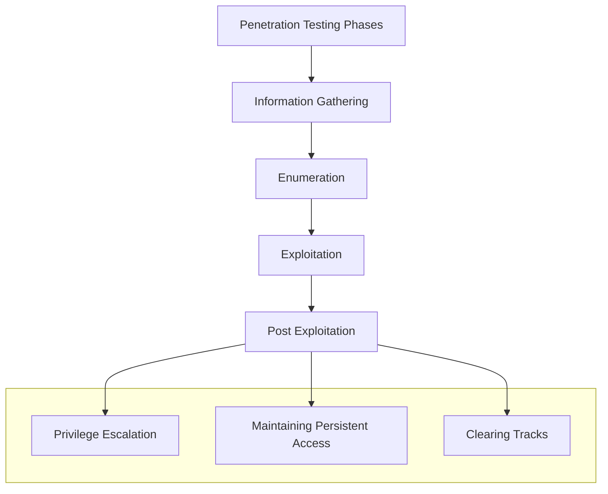

# 1. Introducción a la explotación

La explotación consiste en las técnicas y herramientas utilizadas por los adversarios o los pentesters para obtener un acceso inicial a un sistema o red objetivo. El éxito de la explotación dependerá de la naturaleza y calidad de la recopilación de información y de la enumeración de servicios ya que solo podemos explotar un objetivo si sabemos que es vulnerable.

Según *PTES*, podemos definir las fases de un pentest según el siguiente diagrama:

La metodología usada habitualmente en la fase de explotación sigue el este flujo: identificar servicios vulnerables, identificar y prerarar el código de los exploits, ejecutarlo en el objetivo (de forma manual o automatizada), obtener acceso remoto, evasión de antivirus y pivoting.

### Black box pentest

Una prueba de penetración de caja negra es una evaluación de seguridad en la que al pentester no se le proporciona ninguna información sobre el sistema o la red objetivo (no se facilitan rangos de direcciones IP, información de los sistemas ni credenciales predeterminadas).

El objetivo de una prueba de penetración de caja negra es evaluar con precisión la seguridad de un sistema o red desde la perspectiva de un atacante externo sin privilegios. Este enfoque es muy útil porque demuestra cómo un atacante externo, sin conocimientos internos de la organización, podría comprometer los sistemas o redes de una empresa.

[⟵ Anterior](../03_auditoria/02_grc.md) | [Siguiente ⟶](02_exploits.md)
