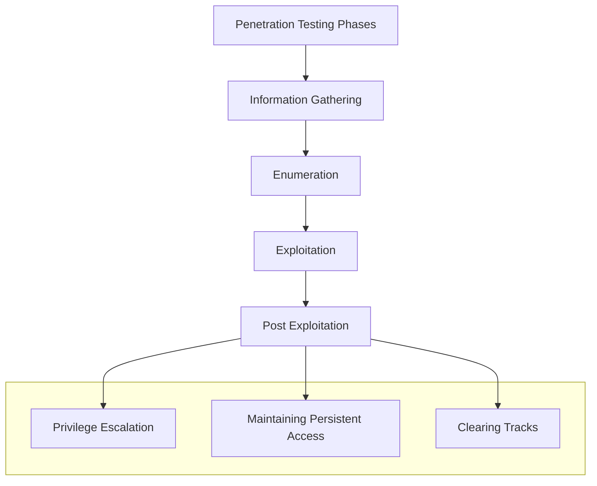

# 1. Introducción a la explotación

La explotación consiste en las técnicas y herramientas utilizadas por los adversarios o los pentesters para obtener un acceso inicial a un sistema o red objetivo. El éxito de la explotación dependerá de la naturaleza y calidad de la recopilación de información y de la enumeración de servicios ya que solo podemos explotar un objetivo si sabemos que es vulnerable.

Según *PTES*, podemos definir las fases de un pentest según el siguiente diagrama:

La metodología usada habitualmente en la fase de explotación sigue el este flujo: identificar servicios vulnerables, identificar y prerarar el código de los exploits, ejecutarlo en el objetivo (de forma manual o automatizada), obtener acceso remoto, evasión de antivirus y pivoting.

