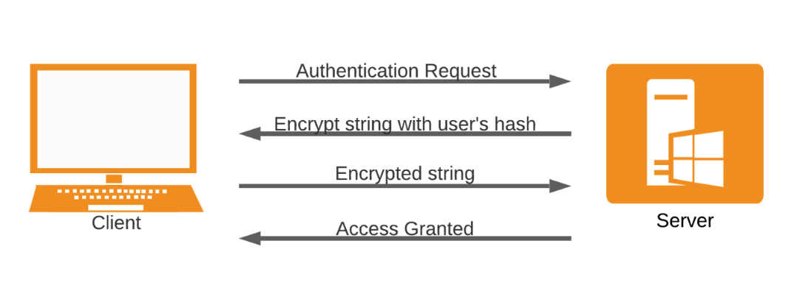

# Explotación de SMB con PsExec

SMB (Server Message Block) es un protocolo de intercambio de archivos y periféricos (impresoras y puertos serie) entre equipos de una red local. Utiliza el puerto 445, sin embargo, originalmente SMB funcionaba sobre NetBIOS utilizando el puerto 139. SAMBA es la implementación de código abierto de SMB para Linux y permite que los sistemas Windows accedan a recursos compartidos y dispositivos de Linux.

El protocolo SMB utiliza dos niveles de autenticación:

- Autenticación de usuario: los usuarios deben proporcionar un nombre de usuario y una contraseña para autenticarse ante el servidor SMB y poder acceder a un recurso compartido.
- Autenticación de recurso compartido: los usuarios deben proporcionar una contraseña para acceder a un recurso compartido restringido.

Ambos niveles de autenticación utilizan un sistema de autenticación de desafío-respuesta (challenge-response).

[⟵ Anterior](../../05_sistema.md#explotación-windows)