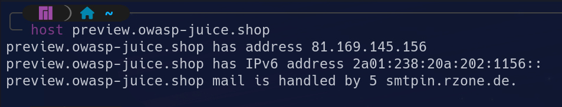
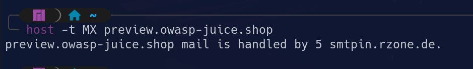
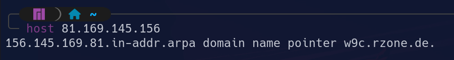

# Host

Es un comando que convierte dominios a direcciones IP y viceversa. Además, también se puede usar para realizar búsquedas DNS.

## Guía de uso

En su uso más común, que es el de obtener la dirección IP de un dominio se usa de la siguiente forma:

``` bash
$ host ejemplo.com
```



A continuación se muestran algunas de las opciones más interesantes en la fase de reconocimiento.

### Consultar tipos de registro

La opción -t permite especificar el tipo de registro DNS a consultar. Los principales registros DNS son:

- ***A***: contiene la dirección IPv4 del dominio.
- ***AAAA***: contiene la dirección IPv6.
- ***CNAME***: redirige el subdominio al dominio principal. Este registro puede revelar subdominios o infraestructura externa.
- ***MX***: muestra los servidores de correo para el dominio.
- ***NS***: servidores autoritativos de la zona, que incluyen la información oficial. Una consulta a estos servidores se puede considerar reconocimiento activo.
- ***TXT***: registros de texto que a veces contienen información sensible.
- ***SOA***: almacena información importante sobre un dominio o una zona, como la dirección de correo electrónico del administrador, cuándo se actualizó el dominio por última vez y cuánto tiempo debe esperar el servidor entre actualizaciones.
- ***PTR***: actúa de forma inversa al registro *A*, es decir, almacena una dirección IP y contiene información sobre el dominio/nombre de host para esa IP.



### Especificar servidor DNS

Esta opción puede ser útil para consultar el servidor dns autoritativo, aunque puede esto considerarse reconocimiento activo al interactuar con el objetivo y poder ser detectados, o para consultar varias fuentes públicas.

``` bash
$ host ejemplo.com 8.8.8.8
```

### Búsqueda inversa

Es útil para buscar subdominios, servicios, host compartidos o proveedores. Es probable que la búsqueda inversa no funcione ya sea por que el registro *PTR* no está configurado (NXDOMAIN), o porque el servidor rechaza la conexión (REFUSED).



### Vervose

Muestra información sobre: qué servidor responde, los encabezados DNS, los tiempos de respuesta, los registros adicionales sin cambiar el tipo de consulta.

``` bash
$ host -v example.com
Trying "example.com"
Using domain server:
Name: 8.8.8.8
Received 125 bytes from 8.8.8.8#53 in 22 ms
;; ->>HEADER<<- opcode: QUERY, status: NOERROR, id: 1234
;; flags: qr rd ra; QUERY: 1, ANSWER: 1, AUTHORITY: 0, ADDITIONAL: 0
example.com has address 93.184.216.34
```

Una opción similar es la consulta completa tipo *ANY*, que muestra todos los registros disponibles para el dominio.

``` bash
$ host -a example.com
Trying "example.com"
Using domain server:
Name: 8.8.8.8
Received 225 bytes from 8.8.8.8#53 in 21 ms
;; ->>HEADER<<- opcode: QUERY, status: NOERROR, id: 1234
;; flags: qr rd ra; QUERY: 1, ANSWER: 5, AUTHORITY: 0, ADDITIONAL: 0
example.com has address 93.184.216.34
example.com mail is handled by 10 mail.example.com.
example.com descriptive text "v=spf1 -all"
example.com name server ns1.example.net.
example.com start of authority ns1.example.net. admin.example.com. ...
```

## Riesgo de detección

El riesgo de detección depende principalmente de a qué servidor se realizan las consultas. Al hacer las consultas de forma pasiva, es decir, a un servidor no autoritativo, no llegan directamente desde nosotros, sino desde el servidor al que consultamos.

Por otro lado, si las consultas son al servidor autoritativo de la empresa, pueden llamar la atención de los sistemas de detección en caso de hacer consultas que soliciten mucha información o enumeración masiva donde se consulta una lista de subdominios.

## Recursos

[Curso de Linux para Hackers – Los comandos Host y Hostmane](https://achirou.com/curso-de-linux-para-hackers-los-comandos-host-y-hostmane/)

[⟵ Anterior](../01_information_gathering.md#reconocimiento-dns)
