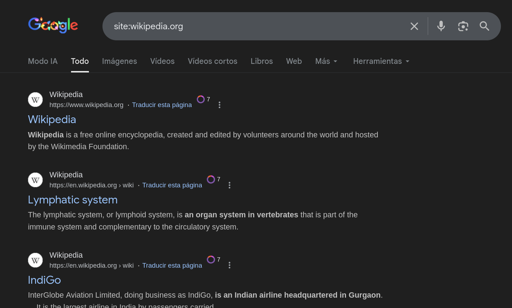
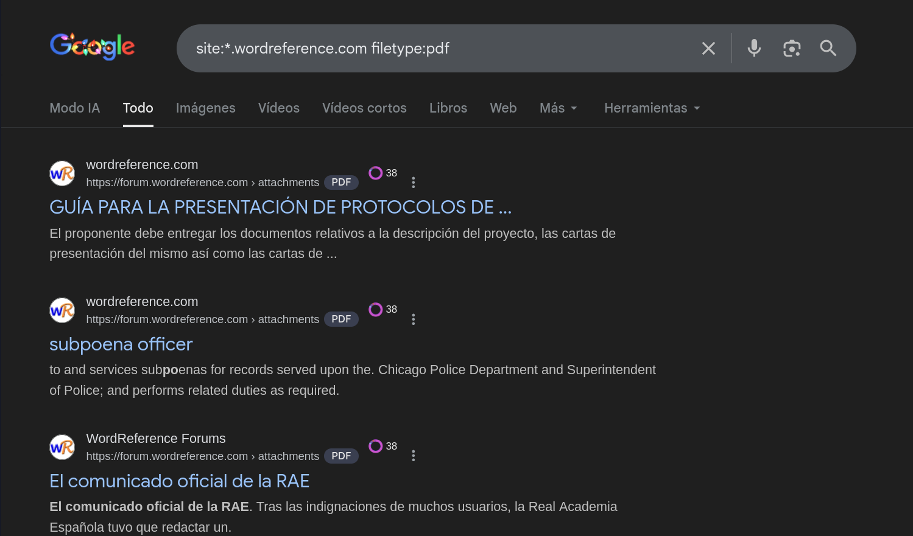

# Google dorks

Los Google dorks o Google hacking dorks son consultas avanzadas de búsqueda en Google que utilizan operadores especiales para encontrar información que no debería ser pública, pero que está indexada por error. No son herramientas de ataque, por lo que forman parte de la recolección de información. Los Google dorks permiten:

- Encontrar información sensible expuesta como: documentos internos indexados, configuraciones visibles, archivos públicos que no deberían estarlo y directorios abiertos
- Identificar tecnologías o versiones o paneles de administración.
- Mapear la superficie de exposición. Ayuda a descubrir: subdominios y páginas ocultas
- Detectar problemas de configuración

> **Nota:** Algunos Google dorks ya no son tan efectivos debido a cambios en la indexación de Google y a mejoras en la configuración de servidores modernos. Aunque siguen siendo útiles para OSINT pasivo, es normal que ciertos comandos históricos devuelvan pocos resultados o funcionen de forma limitada.


## Guía de uso

Se basan en el uso de operadores de búsqueda específicos que permiten refinar los resultados. Encontramos los siguientes operadores:

- **"site:"**: limita las búsquedas a un sitio o dominio particular
- **"filetype:"** o **"ext:"**: enfoca tipos de archivos específicos como documentos PDF o hojas de cálculo Excel.
- **"intitle:"**: busca palabras clave en los títulos de las páginas
- **"inurl:"**: filtra los resultados según la URL.
- **"intext:"**: analiza el contenido de las páginas para búsquedas más complejas
- **"cache:"**: para acceder a las versiones en caché de las páginas*
- **"related:"**: para encontrar sitios similares
- **"info:"**: para obtener información sobre una página específica.



### Subdominios

```bash
$ site:*.example.com
```


### Archivos

```bash
$ site:*.example.com filetype:pdf
```



## Riesgo de detección

Estos comandos son completamente pasivos ya que en ningún momento generan tráfico directo al servidor objetivo.

## Recursos

- [Google Dorks te ayuda a encontrar información sobre ti en la Red](https://www.incibe.es/ciudadania/blog/google-dorks-te-ayuda-encontrar-informacion-sobre-ti-en-la-red)
- [Google Hacking Database (GHDB) | How Hackers and Ethical Hackers Use Google Dorks to Find Exposed Information](https://www.webasha.com/blog/google-hacking-database-ghdb-how-hackers-and-ethical-hackers-use-google-dorks-to-find-exposed-information)
- [Google Dorks: ¿Qué son? ¿Cómo explotarlos?](https://datascientest.com/es/google-dorks-que-son)


[⟵ Anterior](../01_information_gathering/.md#)
