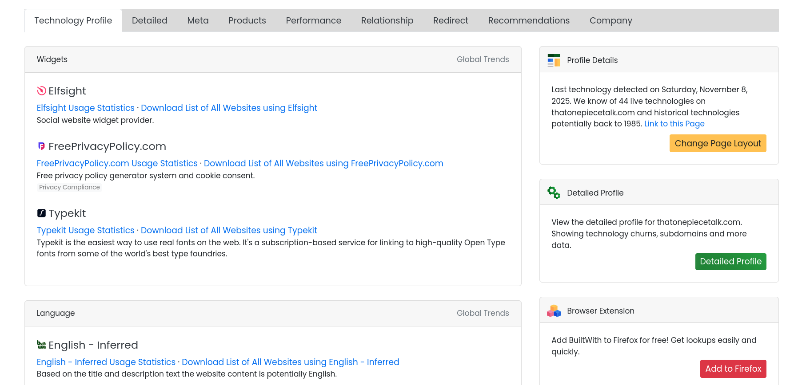

# BuiltWith

[Builtwith](https://builtwith.com) es una herramienta que muestra una lista con todas las tecnologías con las que está construida una web. También está disponible como extensión para varios navegadores, aunque la versión web presenta una mejor visualización de la información. Builtwith analiza un dominio y revela detalles como:

- Lenguajes y frameworks.
- Servidores web.
- Sistemas de gestión de contenido.
- Servicios de terceros integrados.
- Tecnologías de seguridad.
- Plataformas e-commerce.
- Sistemas de publicidad y tracking.

## Guia de uso

Para obtener información con esta herramienta accedemos a su sitio web e ingresamos la url de la web a anlizar. En caso de usar la extensión, simplemente accedemos a la web a analizar con la extensión ya instalada.

## Riesgo de deteccion

BuiltWith es una herramienta pasiva y analiza tecnologías visibles públicamente, generalmente código fuente HTML accesible públiamente, encabezados HTTP Y recursos externos usados por el sítio. Todo esto lo haces sin interactuar de forma intrusiva. Aunque su riesgo de detección es bajo, las conexiones de rastreo realizadas por BuiltWith pueden aparecer en logs, lo que puede generar sospechas de que el objetivo está siendo analizado.

[⟵ Anterior](../01_information_gathering.md#reconocimiento-web)